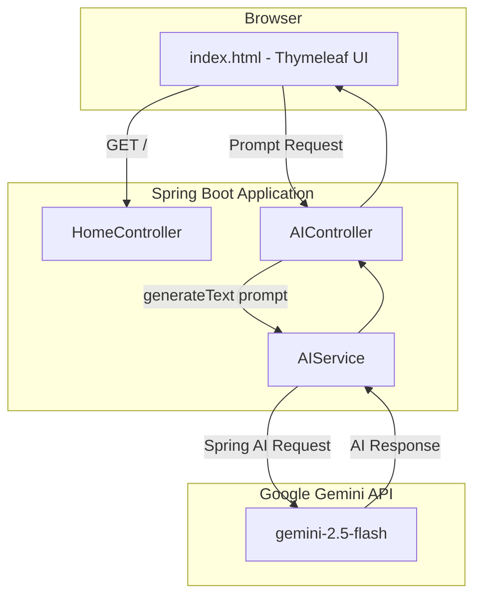

# Spring AI Demo with Google Gemini

A simple Spring Boot application that demonstrates how to integrate Spring AI with Google Gemini for AI-powered text generation.

---

# Features

- Spring Boot backend
- Spring AI integration
- Google Gemini API support
- Thymeleaf frontend UI
- REST API endpoint
- Simple chat interface

---

# Architecture Diagram



---

# Project Components

| Component | Description |
|---|---|
| `HomeController` | Serves the homepage |
| `AIController` | Handles API requests |
| `AIService` | Sends prompts to Gemini |
| `Gemini API` | Generates AI responses |

---

# Application UI

The application runs at:

```text
http://localhost:8080
```

---

## Initial Screen

```text
 -------------------------------------------------------
| Spring AI Demo - Gemini                               |
|                                                       |
| Ask anything                                          |
| ---------------------------------------------------   |
| Explain Spring AI in simple terms...                 |
| ---------------------------------------------------   |
|                                                       |
| [ Ask Gemini ]                                        |
 -------------------------------------------------------
```

---

## Loading State

```text
 -------------------------------------------------------
| Spring AI Demo - Gemini                               |
|                                                       |
| What is Spring AI?                                    |
|                                                       |
| [ Ask Gemini ] (disabled)                             |
|                                                       |
| Thinking...                                           |
 -------------------------------------------------------
```

---

## Response State

```text
 -------------------------------------------------------
| Spring AI Demo - Gemini                               |
|                                                       |
| What is Spring AI?                                    |
|                                                       |
| Spring AI simplifies AI integration in Spring         |
| applications using a unified API.                     |
|                                                       |
 -------------------------------------------------------
```

---

# Step 1 — Create Gemini API Key

1. Open Google AI Studio:

```text
https://aistudio.google.com/app/apikey
```

2. Sign in with your Google account

3. Click **Create API Key**

4. Copy your generated key

---

# Step 2 — Configure the API Key

Open:

```text
src/main/resources/application.properties
```

Add:

```properties
spring.application.name=spring-ai-demo

spring.ai.google.genai.api-key=YOUR_GEMINI_API_KEY

spring.ai.google.genai.chat.options.model=gemini-2.5-flash
```

---

# Secure API Key Setup (Recommended)

Instead of hardcoding the API key:

```properties
spring.ai.google.genai.api-key=${GEMINI_API_KEY}
```

## Windows CMD

```cmd
set GEMINI_API_KEY=your_api_key
```

## PowerShell

```powershell
$env:GEMINI_API_KEY="your_api_key"
```

## Linux/macOS

```bash
export GEMINI_API_KEY=your_api_key
```

---

# Step 3 — Run the Application

```bash
mvn clean install
mvn spring-boot:run
```

Application starts at:

```text
http://localhost:8080
```

---

# Step 4 — Test the API

## Browser

```text
http://localhost:8080/api/ai/ask?prompt=Hello
```

---

## cURL

```bash
curl "http://localhost:8080/api/ai/ask?prompt=What+is+Spring+AI?"
```

---

# Request Flow

```text
User enters prompt
        ↓
Frontend sends request
        ↓
AIController receives request
        ↓
AIService calls Gemini API
        ↓
Gemini generates response
        ↓
Response displayed on UI
```

---

# Technologies Used

| Technology | Purpose |
|---|---|
| Java | Backend Language |
| Spring Boot | Application Framework |
| Spring AI | AI Integration |
| Thymeleaf | Frontend UI |
| Maven | Build Tool |
| Google Gemini | AI Model |

---

# Keyboard Shortcuts

- `Ctrl + Enter` → Submit prompt (Windows/Linux)
- `Cmd + Enter` → Submit prompt (macOS)

---

# Future Enhancements

- Chat history
- Streaming responses
- Markdown support
- Multiple AI models
- Authentication
- Docker deployment

---

# Author

Built using Spring Boot, Spring AI, and Google Gemini.
